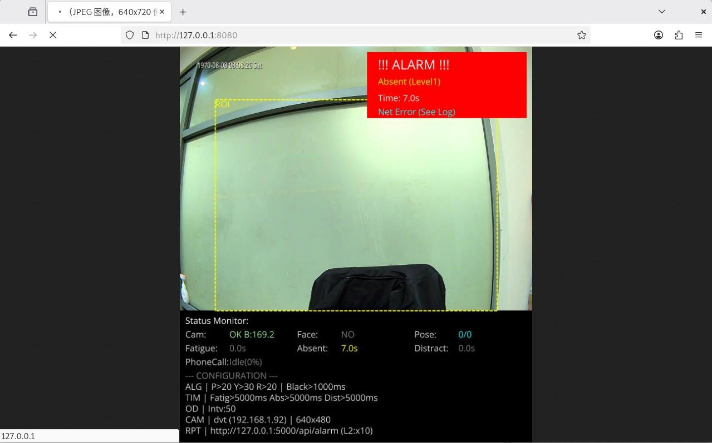

# 威视疲劳检测系统 — 功能介绍

## 一、系统概述

威视疲劳检测系统是一款基于计算机视觉的实时监控软件，通过摄像头采集画面，对操作人员的**疲劳状态、分心行为、离岗情况、手机使用行为**进行智能识别与报警。系统支持多种摄像头接入方式，具备多级报警升级机制和远程上报能力，适用于安检、监控值守等需要持续关注人员状态的应用场景。

---

## 二、系统界面

### 实时监控预览界面

系统启动后，通过浏览器访问 `http://设备IP:8080` 即可查看实时视频流。



界面主要由以下区域组成：

| 区域 | 说明 |
|------|------|
| **视频画面区** | 实时采集的摄像头画面，叠加 ROI 区域框（黄色虚线）、人脸检测框、关键点标记 |
| **报警提示区**（右上角红色区域） | 当前报警状态，包括报警类型、报警等级（Level1/2/3）、持续时间 |
| **状态监控区**（Status Monitor） | 实时显示各检测模块的运行状态 |
| **配置信息区**（CONFIGURATION） | 当前生效的算法参数和设备配置 |

### 状态监控面板详解

```
Status Monitor:
Cam:      OK B:169.2      -- 摄像头状态及画面亮度值
Face:     NO               -- 是否检测到人脸
Pose:     0/0              -- 头部姿态是否超出阈值
Fatigue:  0.0s             -- 疲劳（闭眼）持续时间
Absent:   7.0s             -- 离岗持续时间
Distract: 0.0s             -- 分心持续时间
Phone:    Idle(0%)         -- 手机检测状态及置信度
```

### 配置信息面板详解

```
ALG | P>20 Y>30 R>20 | Black>1000ms    -- 头部角度阈值 & 黑屏阈值
TIM | Fatig>5000ms Abs>5000ms Dist>5000ms  -- 各报警时间阈值
OD  | Intv:50                           -- 人形检测间隔帧数
CAM | dvt (192.168.1.92) | 640x480      -- 摄像头类型、地址、分辨率
RPT | http://127.0.0.1:5000/api/alarm    -- 报警上报接口地址
```

---

## 三、核心功能

### 3.1 疲劳检测

| 项目 | 说明 |
|------|------|
| **功能描述** | 检测操作人员双眼闭合状态，判断是否处于疲劳状态 |
| **触发条件** | 双眼闭合持续超过设定阈值时间（默认 2000ms） |
| **报警类型** | Fatigue（疲劳报警） |
| **配置参数** | `Algorithm.FatigueTimeMs`：疲劳报警时间阈值（毫秒） |

### 3.2 分心检测

| 项目 | 说明 |
|------|------|
| **功能描述** | 检测操作人员头部姿态，判断是否偏离正常工作姿态 |
| **触发条件** | 头部偏转超过角度阈值，且持续超过设定时间（默认 2000ms） |
| **报警类型** | Distraction（分心报警） |
| **角度阈值** | Pitch > 20°（上下点头）、Yaw > 30°（左右转头）、Roll > 20°（左右歪头） |
| **配置参数** | `Algorithm.DistractionTimeMs`、`Algorithm.MaxPitch`、`Algorithm.MaxYaw`、`Algorithm.MaxRoll` |

### 3.3 离岗检测

| 项目 | 说明 |
|------|------|
| **功能描述** | 检测画面中是否有人，判断操作人员是否离开工位 |
| **触发条件** | 持续无人超过设定时间（默认 5000ms） |
| **报警类型** | Absent（离岗报警） |
| **配置参数** | `Algorithm.AbsenceTimeMs`：离岗报警时间阈值（毫秒） |

### 3.4 手机检测

| 项目 | 说明 |
|------|------|
| **功能描述** | 检测操作人员是否在使用手机 |
| **触发条件** | 持续检测到手机达到触发时间（默认 3 秒），且确认比率 ≥ 60% |
| **报警类型** | Phone（手机检测报警） |
| **防误报机制** | 丢失容忍（0.5s）、记忆窗口（1.5s）、冷却时间（3s）、分类器二次过滤 |
| **配置文件** | `phone-detection.json` |

### 3.5 黑屏/摄像头异常检测

| 项目 | 说明 |
|------|------|
| **功能描述** | 检测摄像头画面是否异常（如黑屏、遮挡等） |
| **触发条件** | 黑屏持续超过设定时间（默认 1000ms） |
| **报警类型** | 摄像头异常报警 |
| **配置参数** | `Camera.CheckBlack`、`Camera.BrightnessThreshold`、`Algorithm.BlackScreenTimeMs` |

---

## 四、报警机制

### 4.1 多级报警升级

系统支持三级报警升级，根据异常持续时间与阈值的比率自动升级：

| 报警等级 | 触发条件 | 默认配置 |
|----------|----------|----------|
| **Level 1** | 异常持续时间 ≥ 报警阈值 | 达到阈值即触发 |
| **Level 2** | 持续时间 / 阈值 ≥ 1.5 倍 | 如疲劳阈值2s，持续3s升级 |
| **Level 3** | 持续时间 / 阈值 ≥ 2.0 倍 | 如疲劳阈值2s，持续4s升级 |

### 4.2 报警上报

- **上报方式**：HTTP POST 请求，发送 JSON 数据 + Base64 编码截图
- **上报地址**：可配置（默认 `http://127.0.0.1:5000/api/alarm`）
- **升级通知**：可配置每次升级时是否重新上报
- **截图清理**：报警截图按日期文件夹存储，支持自动清理（默认保留 30 天）

---

## 五、摄像头支持

| 类型 | 标识 | 说明 |
|------|------|------|
| **本地视频文件** | `file` | 播放本地视频文件用于测试调试 |
| **USB 摄像头** | `usb` | 连接本机 USB 摄像头，通过设备索引指定 |
| **海康设备** | `hik` | 连接海康威视网络摄像头，需配置 IP、用户名、密码 |
| **DVT 设备** | `dvt` | 连接 DVT 网络摄像头，需配置 IP、用户名、密码 |

---

## 六、可视化调试选项

系统支持在实时画面上叠加调试信息，方便现场调试和参数调优：

| 选项 | 说明 | 默认 |
|------|------|------|
| `ShowLandmarks` | 显示人脸关键点（鼻子、眼睛、嘴角等） | 开启 |
| `ShowFaceBox` | 显示人脸检测框（绿色矩形） | 开启 |
| `ShowDebugText` | 显示调试文字（报警状态、计时器、配置参数） | 开启 |

---

## 七、部署说明

### 7.1 运行环境

- **操作系统**：Linux（Ubuntu）
- **依赖库**：OpenCV（libopencv-videoio、libopencv-imgcodecs、libopencv-imgproc）
- **硬件要求**：需插入加密狗进行硬件授权验证
- **安装目录**（示例）：`/home/nuctech/pstech/pstech_test260123/csharp_app/`

### 7.2 部署步骤

1. **确认安装目录**，将程序文件拷贝至目标路径
2. **连接摄像头**，在 `universal_run.sh` 中修改摄像头 IP 地址
3. **修改配置文件**：
   - `appsettings.json` — 主配置（摄像头、算法、报警等）
   - `phone-detection.json` — 手机检测参数
4. **安装依赖**：
   - 有网络：`sudo apt install libopencv-videoio4.5 libopencv-imgcodecs4.5 libopencv-imgproc4.5`
   - 无网络：拷贝离线包后执行 `sudo dpkg -i *.deb`
5. **启动程序**：
   ```bash
   sudo chmod +x universal_run.sh
   sudo ./universal_run.sh cs_dvt
   ```
6. **注册为系统服务**（可选）：
   ```bash
   sudo chmod +x install_service.sh
   sudo ./install_service.sh
   systemctl status pstech.service
   ```
7. **验证**：浏览器访问 `http://localhost:8080` 查看实时监控画面

---

## 八、配置文件参考

### appsettings.json 主要参数

| 模块 | 参数 | 默认值 | 说明 |
|------|------|--------|------|
| Camera | Type | file | 摄像头类型（file/usb/hik/dvt） |
| Camera | ConnectionString | - | 连接地址或视频文件路径 |
| Camera | Width / Height | 640 / 480 | 采集分辨率 |
| Camera | CheckBlack | true | 是否启用黑屏检测 |
| Camera | BrightnessThreshold | 10.0 | 黑屏亮度阈值（0~255） |
| Algorithm | FatigueTimeMs | 2000 | 疲劳报警阈值（ms） |
| Algorithm | DistractionTimeMs | 2000 | 分心报警阈值（ms） |
| Algorithm | AbsenceTimeMs | 5000 | 离岗报警阈值（ms） |
| Algorithm | BlackScreenTimeMs | 1000 | 黑屏报警阈值（ms） |
| Algorithm | MaxPitch | 20° | 俯仰角阈值 |
| Algorithm | MaxYaw | 30° | 偏航角阈值 |
| Algorithm | MaxRoll | 20° | 翻滚角阈值 |
| Report | Enable | true | 是否启用报警上报 |
| Report | ApiUrl | http://127.0.0.1:5000/api/alarm | 上报接口 |
| Report | Level2Ratio | 1.5 | 二级报警升级系数 |
| Report | Level3Ratio | 2.0 | 三级报警升级系数 |
| Report | CaptureRetentionDays | 30 | 截图保留天数 |

### phone-detection.json 主要参数

| 参数 | 默认值 | 说明 |
|------|--------|------|
| Enabled | true | 是否启用手机检测 |
| ModelPath | data/od.onnx | 手机检测模型路径 |
| ConfThreshold | 0.25 | 手机检测置信度阈值 |
| DetectInterval | 3 | 检测间隔帧数 |
| ClassifierEnabled | true | 是否启用分类器二次过滤 |
| Rules.TriggerSeconds | 3.0 | 手机检测触发时间（秒） |
| Rules.ConfirmRatio | 0.6 | 确认比率 |
| Rules.CooldownSeconds | 3.0 | 冷却时间（秒） |
